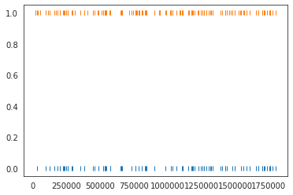
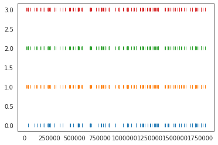

Comparison Tutorial
===================

This notebook shows how to use the spiketoolkit.comparison module to:

1. compare pair of spike sorters
2. compare multiple spike sorters
3. extract units in agreement with multiple sorters (consensus-based)
4. compare spike sprting output with ground-truth recording
5. run "study" :  systematic performance comparisons

.. code:: python

    import spiketoolkit as st
    import spikeextractors as se
    import numpy as np
    import pandas as pd
    import seaborn as sn
    import shutil
    import time
    from pathlib import Path
    import matplotlib.pyplot as plt
    %matplotlib notebook

First, let's create a toy example:

.. code:: python

    recording, sorting = se.example_datasets.toy_example(num_channels=4, duration=30)

1) Compare two spike sorters
----------------------------

First, we will run two spike sorters and compare their ouput.

.. code:: python

    sorting_KL = st.sorters.run_klusta(recording)
    sorting_MS4 = st.sorters.run_mountainsort4(recording)

.. parsed-literal::

    ...

The ``compare_two_sorters`` function allows us to compare the spike
sorting output. It returns a ``SortingComparison`` object, with methods
to inspect the comparison output easily. The comparison matches the
units by comparing the agreement between unit spike trains.

Let’s see how to inspect and access this matching.

.. code:: python

    cmp_KL_MS4 = st.comparison.compare_two_sorters(sorting1=sorting_KL, sorting2=sorting_MS4, 
                                                   sorting1_name='klusta', sorting2_name='ms4')

In order to check which units were matched, the ``get_mapped_sorting``
methods can be used. If units are not matched they are listed as -1.

.. code:: python

    # units matched to klusta units
    mapped_sorting_klusta = cmp_KL_MS4.get_mapped_sorting1()
    print('Klusta units:', sorting_KL.get_unit_ids())
    print('Klusta mapped units:', mapped_sorting_klusta.get_mapped_unit_ids())
    
    # units matched to ms4 units
    mapped_sorting_ms4 = cmp_KL_MS4.get_mapped_sorting2()
    print('Mountainsort units:',sorting_MS4.get_unit_ids())
    print('Mountainsort mapped units:',mapped_sorting_ms4.get_mapped_unit_ids())

.. parsed-literal::

    Klusta units: [0, 2, 3, 4, 5, 6, 7, 8]
    Klusta mapped units: [-1, 16, 8, -1, -1, -1, 4, -1]
    Mountainsort units: [ 3  4  5  7  8  9 11 13 16]
    Mountainsort mapped units: [-1, 7, -1, -1, 3, -1, -1, -1, 2]

The ``get_unit_spike_train`` returns the mapped spike train. We can use
it to check the spike times.

.. code:: python

    # check that matched spike trains correspond
    plt.plot(sorting_KL.get_unit_spike_train(7),
             np.zeros(len(sorting_KL.get_unit_spike_train(7))), '|')
    plt.plot(mapped_sorting_klusta.get_unit_spike_train(7),
             np.ones(len(mapped_sorting_klusta.get_unit_spike_train(7))), '|')

2) Compare multiple spike sorter outputs
----------------------------------------

With 3 or more spike sorters, the comparison is implemented with a
graph-based method. The multiple sorter comparison also allows to clean
the output by applying a consensus-based method which only selects spike
trains and spikes in agreement with multiple sorters.

.. code:: python

    sorting_TDC = st.sorters.run_tridesclous(recording)

.. parsed-literal::

   ...

.. code:: python

    mcmp = st.comparison.compare_multiple_sorters(sorting_list=[sorting_KL, sorting_MS4, sorting_TDC], 
                                                  name_list=['KL', 'MS4', 'TDC'], verbose=True)

.. parsed-literal::

    Comparing:  KL  and  MS4
    Matching...
    do_score_labels...
    Comparing:  KL  and  TDC
    Matching...
    do_score_labels...
    Comparing:  MS4  and  KL
    Matching...
    do_score_labels...
    Comparing:  MS4  and  TDC
    Matching...
    do_score_labels...
    Comparing:  TDC  and  KL
    Matching...
    do_score_labels...
    Comparing:  TDC  and  MS4
    Matching...
    do_score_labels...
    Adding edge:  KL_2 MS4_16
    Adding edge:  KL_2 TDC_1
    Adding edge:  KL_3 MS4_8
    Adding edge:  KL_7 MS4_4
    Adding edge:  KL_7 TDC_0
    Adding edge:  KL_8 TDC_5
    Adding edge:  MS4_3 TDC_7
    Adding edge:  MS4_4 TDC_0
    Adding edge:  MS4_7 TDC_3
    Adding edge:  MS4_11 TDC_2
    Adding edge:  MS4_16 TDC_1

The multiple sorters comparison internally computes pairwise comparison,
that can be accessed as follows:

.. code:: python

    mcmp.sorting_comparisons['KL']['TDC'].get_mapped_sorting1().get_mapped_unit_ids()

.. parsed-literal::

    [-1, 1, -1, -1, -1, -1, 0, 5]

.. code:: python

    mcmp.sorting_comparisons['KL']['MS4'].get_mapped_sorting1().get_mapped_unit_ids()

.. parsed-literal::

    [-1, 16, 8, -1, -1, -1, 4, -1]

.. code:: python

    mcmp.sorting_comparisons['MS4']['TDC'].get_mapped_sorting1().get_mapped_unit_ids()

.. parsed-literal::

    [7, 0, -1, 3, -1, -1, 2, -1, 1]

We can see that there is a better agreement between tridesclous and
mountainsort (5 units matched), while klusta only has two matched units
with tridesclous, and three with mountainsort.

3) Consensus-based method
-------------------------

We can pull the units in agreement with different sorters using the
``get_agreement_sorting`` method. This allows to make spike sorting more
robust by integrating the output of several algorithms. On the other
hand, it might suffer from weak performance of single algorithms.

When extracting the units in agreement, the spike trains are modified so
that only the true positive spikes between the comparison with the best
match are used.

.. code:: python

    agr_3 = mcmp.get_agreement_sorting(minimum_matching=3)
    print('Units in agreement for all three sorters: ', agr_3.get_unit_ids())

.. parsed-literal::

    Units in agreement for all three sorters:  [1, 9]

.. code:: python

    agr_2 = mcmp.get_agreement_sorting(minimum_matching=2)
    print('Units in agreement for at least sorters: ', agr_2.get_unit_ids())

.. parsed-literal::

    Units in agreement for at least sorters:  [1, 4, 9, 12, 14, 17, 20]

.. code:: python

    agr_all = mcmp.get_agreement_sorting()
    print('All units found: ', agr_all.get_unit_ids())

.. parsed-literal::

    All units found:  [0, 1, 4, 6, 7, 8, 9, 12, 14, 16, 17, 19, 20, 22, 23, 24]

The unit index of the different sorters can also be retrieved from the
agreement sorting object (``agr_3``) property ``sorter_unit_ids``.

.. code:: python

    print(agr_3.get_unit_property_names())

.. parsed-literal::

    ['avg_agreement', 'matched_number', 'sorter_unit_ids']

.. code:: python

    print(agr_3.get_unit_property(9, 'sorter_unit_ids'))

.. parsed-literal::

    {'KL': 7, 'MS4': 4, 'TDC': 0}

Now that we found our unit, we can plot a rasters with the spike trains
of the single sorters and the one from the consensus based method. When
extracting the agreement sorting, spike trains are cleaned so that only
true positives remain from the comparison with the largest agreement are
kept. Let’s take a look at the raster plots for the different sorters
and the agreement sorter:

.. code:: python

    plt.figure()
    plt.plot(sorting_KL.get_unit_spike_train(7), 
             0*np.ones(len(sorting_KL.get_unit_spike_train(7))), '|')
    plt.plot(sorting_MS4.get_unit_spike_train(4), 
             1*np.ones(len(sorting_MS4.get_unit_spike_train(4))), '|')
    plt.plot(sorting_TDC.get_unit_spike_train(0), 
             2*np.ones(len(sorting_TDC.get_unit_spike_train(0))), '|')
    plt.plot(agr_3.get_unit_spike_train(9), 
             3*np.ones(len(agr_3.get_unit_spike_train(9))), '|')
    
    print('Klusta spike train length', len(sorting_KL.get_unit_spike_train(7)))
    print('Mountainsort spike train length', len(sorting_MS4.get_unit_spike_train(4)))
    print('Tridesclous spike train length', len(sorting_TDC.get_unit_spike_train(0)))
    print('Agreement spike train length', len(agr_3.get_unit_spike_train(9)))

.. parsed-literal::

    Klusta spike train length 93
    Mountainsort spike train length 146
    Tridesclous spike train length 145
    Agreement spike train length 145

As we can see, the best match is between Mountainsort and Tridesclous,
but only the true positive spikes make up the agreement spike train.

4) Compare spike sprting output with ground-truth recordings
------------------------------------------------------------

Simulated recordings or paired pipette and extracellular recordings can
be used to validate spike sorting algorithms.

For comparing to ground-truth data, the
``compare_sorter_to_ground_truth(gt_sorting, tested_sorting)`` function
can be used. In this recording, we have ground-truth information for all
units, so we can set ``exhaustive_gt`` to ``True``.

.. code:: python

    cmp_gt_MS4 = st.comparison.compare_sorter_to_ground_truth(sorting_true, sorting_MS4, exhaustive_gt=True)

This function first matches the ground-truth and spike sorted units, and
then it computes several performance metrics.

Once the spike trains are matched, each spike is labelled as: - true
positive (tp): spike found both in ``gt_sorting`` and ``tested_sorting``
- false negative (fn): spike found in ``gt_sorting``, but not in
``tested_sorting`` - false positive (fp): spike found in
``tested_sorting``, but not in ``gt_sorting`` - misclassification errors
(cl): spike found in ``gt_sorting``, not in ``tested_sorting``, found in
another matched spike train of ``tested_sorting``, and not labelled as
true positives

From the counts of these labels the following performance measures are
computed:

-  accuracy: #tp / (#tp+ #fn + #fp)
-  recall: #tp / (#tp + #fn)
-  precision: #tp / (#tp + #fn)
-  miss rate: #fn / (#tp + #fn1)
-  false discovery rate: #fp / (#tp + #fp)

The ``get_performance`` method a pandas dataframe (or a dictionary if
``output='dict'``) with the comparison metrics. By default, these are
calculated for each spike train of ``sorting1``, the results can be
pooles by average (average of the metrics) and by sum (all counts are
summed and the metrics are computed then).

.. code:: python

    cmp_gt_MS4.get_performance()

.. raw:: html

    

    
    <table border="1" class="dataframe">
      <thead>
        <tr style="text-align: right;">
          <th></th>
          <th>accuracy</th>
          <th>recall</th>
          <th>precision</th>
          <th>false_discovery_rate</th>
          <th>miss_rate</th>
          <th>misclassification_rate</th>
        </tr>
      </thead>
      <tbody>
        <tr>
          <th>1</th>
          <td>1.000000</td>
          <td>1.000000</td>
          <td>1.000000</td>
          <td>0.000000</td>
          <td>0.000000</td>
          <td>0.000000</td>
        </tr>
        <tr>
          <th>2</th>
          <td>0.985915</td>
          <td>0.985915</td>
          <td>1.000000</td>
          <td>0.000000</td>
          <td>0.014085</td>
          <td>0.000000</td>
        </tr>
        <tr>
          <th>3</th>
          <td>1.000000</td>
          <td>1.000000</td>
          <td>1.000000</td>
          <td>0.000000</td>
          <td>0.000000</td>
          <td>0.000000</td>
        </tr>
        <tr>
          <th>4</th>
          <td>1.000000</td>
          <td>1.000000</td>
          <td>1.000000</td>
          <td>0.000000</td>
          <td>0.000000</td>
          <td>0.007092</td>
        </tr>
        <tr>
          <th>5</th>
          <td>0.986111</td>
          <td>0.986111</td>
          <td>1.000000</td>
          <td>0.000000</td>
          <td>0.013889</td>
          <td>0.000000</td>
        </tr>
        <tr>
          <th>6</th>
          <td>0.000000</td>
          <td>0.000000</td>
          <td>NaN</td>
          <td>NaN</td>
          <td>1.000000</td>
          <td>0.000000</td>
        </tr>
        <tr>
          <th>7</th>
          <td>0.986014</td>
          <td>0.986014</td>
          <td>1.000000</td>
          <td>0.000000</td>
          <td>0.013889</td>
          <td>0.006944</td>
        </tr>
        <tr>
          <th>8</th>
          <td>0.958333</td>
          <td>0.992806</td>
          <td>0.965035</td>
          <td>0.034965</td>
          <td>0.007143</td>
          <td>0.007143</td>
        </tr>
        <tr>
          <th>9</th>
          <td>0.977612</td>
          <td>0.984962</td>
          <td>0.992424</td>
          <td>0.007576</td>
          <td>0.014085</td>
          <td>0.063380</td>
        </tr>
        <tr>
          <th>10</th>
          <td>1.000000</td>
          <td>1.000000</td>
          <td>1.000000</td>
          <td>0.000000</td>
          <td>0.000000</td>
          <td>0.000000</td>
        </tr>
      </tbody>
    </table>
    

We can query the well and bad detected units. By default, the threshold
on accuracy is 0.95.

.. code:: python

    cmp_gt_MS4.get_well_detected_units()

.. parsed-literal::

    [1, 2, 3, 4, 5, 7, 8, 9, 10]

.. code:: python

    cmp_gt_MS4.get_false_positive_units()

.. parsed-literal::

    []

.. code:: python

    cmp_gt_MS4.get_redundant_units()

.. parsed-literal::

    []

.. code:: python

    cmp_gt_KL = st.comparison.compare_sorter_to_ground_truth(sorting_true, sorting_KL, exhaustive_gt=True)
    cmp_gt_KL.get_performance()

.. raw:: html

    

    
    <table border="1" class="dataframe">
      <thead>
        <tr style="text-align: right;">
          <th></th>
          <th>accuracy</th>
          <th>recall</th>
          <th>precision</th>
          <th>false_discovery_rate</th>
          <th>miss_rate</th>
          <th>misclassification_rate</th>
        </tr>
      </thead>
      <tbody>
        <tr>
          <th>1</th>
          <td>0.636986</td>
          <td>0.636986</td>
          <td>1.0</td>
          <td>0.0</td>
          <td>0.363014</td>
          <td>0.0</td>
        </tr>
        <tr>
          <th>2</th>
          <td>0.000000</td>
          <td>0.000000</td>
          <td>NaN</td>
          <td>NaN</td>
          <td>1.000000</td>
          <td>0.0</td>
        </tr>
        <tr>
          <th>3</th>
          <td>0.000000</td>
          <td>0.000000</td>
          <td>NaN</td>
          <td>NaN</td>
          <td>1.000000</td>
          <td>0.0</td>
        </tr>
        <tr>
          <th>4</th>
          <td>0.943262</td>
          <td>0.943262</td>
          <td>1.0</td>
          <td>0.0</td>
          <td>0.056738</td>
          <td>0.0</td>
        </tr>
        <tr>
          <th>5</th>
          <td>0.000000</td>
          <td>0.000000</td>
          <td>NaN</td>
          <td>NaN</td>
          <td>1.000000</td>
          <td>0.0</td>
        </tr>
        <tr>
          <th>6</th>
          <td>0.000000</td>
          <td>0.000000</td>
          <td>NaN</td>
          <td>NaN</td>
          <td>1.000000</td>
          <td>0.0</td>
        </tr>
        <tr>
          <th>7</th>
          <td>0.000000</td>
          <td>0.000000</td>
          <td>NaN</td>
          <td>NaN</td>
          <td>1.000000</td>
          <td>0.0</td>
        </tr>
        <tr>
          <th>8</th>
          <td>0.000000</td>
          <td>0.000000</td>
          <td>NaN</td>
          <td>NaN</td>
          <td>1.000000</td>
          <td>0.0</td>
        </tr>
        <tr>
          <th>9</th>
          <td>0.000000</td>
          <td>0.000000</td>
          <td>NaN</td>
          <td>NaN</td>
          <td>1.000000</td>
          <td>0.0</td>
        </tr>
        <tr>
          <th>10</th>
          <td>0.986486</td>
          <td>0.986486</td>
          <td>1.0</td>
          <td>0.0</td>
          <td>0.013514</td>
          <td>0.0</td>
        </tr>
      </tbody>
    </table>
    

.. code:: python

    cmp_gt_KL.get_well_detected_units()

.. parsed-literal::

    [10]

.. code:: python

    cmp_gt_KL.get_false_positive_units()

.. parsed-literal::

    []

.. code:: python

    cmp_gt_KL.get_redundant_units()

.. parsed-literal::

    [0, 4, 5, 6, 8]

.. code:: python

    cmp_gt_KL.get_bad_units()

.. parsed-literal::

    [0, 4, 5, 6, 8]

This notebook showed the capabilities of ``spiketoolkit`` to perform
pair-wise comparisons between spike sorting outputs, comparisons among
multiple sorters and consensus-based spike sorting, and systematic
comparisons for grount-truth data.
