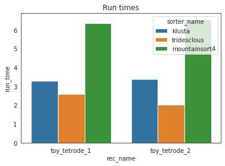
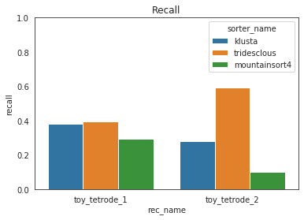

Ground truth study Tutorial
===================

This notebook illustrates how to run a "study".
A study is a systematic performance comparisons several ground truth
recordings with several sorters.

The submodule study and the class  propose high level tools functions
to run many groundtruth comparison with many sorter on many recordings
and then collect and aggregate results in an easy way.

The all mechanism is based on an intrinsinct organisation
into a "study_folder" with several subfolder:
  * raw_files : contain a copy in binary format of recordings
  * sorter_folders : contains output of sorters
  * ground_truth : contains a copy of sorting ground  in npz format
  * sortings: contains light copy of all sorting in npz format
  * tables: some table in cvs format

In order to run and re run the computation all gt_sorting anf
recordings are copied to a fast and universal format : 
binary (for recordings) and npz (for sortings).

  

1 Setup study folder and run all sorters
~~~~~~~~~~~~~~~~~~~~~~~~~~~~~~~~~~~~~~~~~~

We first generate the folder.
this can take some time because recordings are copied inside the folder.

.. code:: python
    
    from spiketoolkit.study import GroundTruthStudy

    rec0, gt_sorting0 = se.example_datasets.toy_example(num_channels=4, duration=30, seed=10)
    rec1, gt_sorting1 = se.example_datasets.toy_example(num_channels=4, duration=30, seed=20)
    gt_dict = {
        'rec0': (rec0, gt_sorting0),
        'rec1': (rec1, gt_sorting1),
    }
    study_folder = 'a_study_folder'
    study = GroundTruthStudy.setup(study_folder, gt_dict)
    
    

Then just run all sorters on all recordings in one functions.

.. code:: python

    # sorter_list = st.sorters.available_sorters() # this get all sorters.
    sorter_list = ['klusta', 'tridesclous', 'mountainsort4']
    study.run_sorters(sorter_list, mode="keep")

You can re run **run_study_sorters** as many time as you want.
By default **mode='keep'** so only uncomputed sorter are rerun.
For instance, so just remove the "sorter_folders/rec1/herdingspikes" to re run 
only one sorter on one recording.

Then we copy copy sorting into a separate subfolder.
This allow to remote the "big" sorter_folders.

.. code:: python

    study.copy_sortings()
    

2 Collect comparisons
~~~~~~~~~~~~~~~~~~~~~~~

You can collect in one shot all results and run the
GroundTruthComparison on it.
So you can acces finely to all individual results.

Note that exhaustive_gt=True when you excatly how many
units in ground truth (for synthetic datasets)

.. code:: python
    
    study.run_comparisons(exhaustive_gt=True)
    
    comparisons = aggregate_sorting_comparison(study_folder, exhaustive_gt=True)
    
    for (rec_name, sorter_name), comp in study.comparisons.items():
        print('*'*10)
        print(rec_name, sorter_name)
        print(comp.count) # raw counting of tp/fp/...
        comp.print_summary()
        perf = comp.get_performance(method='by_unit')
        perf = comp.get_performance(method='pooled_with_average')
        m = comp.get_confusion_matrix()
        comp.plot_confusion_matrix()
        

3 Collect synthetic dataframes and display
~~~~~~~~~~~~~~~~~~~~~~~~~~~~~~~~~~~~~~~~~~~~

As shown previously, the performance is returned as a pandas dataframe.
The ``aggregate_performances_table`` function, gathers all the outputs in
the study folder and merges them in a single dataframe.

.. code:: python

    dataframes = study.aggregate_dataframes()

Pandas dataframes can be nicely displayed as tables in the notebook.

.. code:: python

    dataframes.keys()

.. parsed-literal::

    dict_keys(['run_times', 'perf_pooled_with_average', 'count_units'])

.. code:: python

    dataframes['perf_pooled_with_average']

    

.. code:: python

    dataframes['perf_pooled_with_average']

.. raw:: html

    

    
    <table border="1" class="dataframe">
      <thead>
        <tr style="text-align: right;">
          <th></th>
          <th></th>
          <th>accuracy</th>
          <th>recall</th>
          <th>precision</th>
          <th>false_discovery_rate</th>
          <th>miss_rate</th>
          <th>misclassification_rate</th>
        </tr>
        <tr>
          <th>rec_name</th>
          <th>sorter_name</th>
          <th></th>
          <th></th>
          <th></th>
          <th></th>
          <th></th>
          <th></th>
        </tr>
      </thead>
      <tbody>
        <tr>
          <th rowspan="3" valign="top">toy_tetrode_1</th>
          <th>klusta</th>
          <td>0.380913</td>
          <td>0.382283</td>
          <td>0.996575</td>
          <td>0.00342466</td>
          <td>0.617016</td>
          <td>0.00871697</td>
        </tr>
        <tr>
          <th>tridesclous</th>
          <td>0.326454</td>
          <td>0.39726</td>
          <td>0.822985</td>
          <td>0.177015</td>
          <td>0.60274</td>
          <td>0</td>
        </tr>
        <tr>
          <th>mountainsort4</th>
          <td>0.290309</td>
          <td>0.291623</td>
          <td>0.99537</td>
          <td>0.00462963</td>
          <td>0.708377</td>
          <td>0</td>
        </tr>
        <tr>
          <th rowspan="3" valign="top">toy_tetrode_2</th>
          <th>klusta</th>
          <td>0.229062</td>
          <td>0.280926</td>
          <td>0.857693</td>
          <td>0.142307</td>
          <td>0.718005</td>
          <td>0.00294118</td>
        </tr>
        <tr>
          <th>tridesclous</th>
          <td>0.56482</td>
          <td>0.594364</td>
          <td>0.950502</td>
          <td>0.0494977</td>
          <td>0.405636</td>
          <td>0</td>
        </tr>
        <tr>
          <th>mountainsort4</th>
          <td>0.1</td>
          <td>0.1</td>
          <td>1</td>
          <td>0</td>
          <td>0.9</td>
          <td>0</td>
        </tr>
      </tbody>
    </table>
    

.. code:: python

    dataframes['run_times']

.. raw:: html

    

    
    <table border="1" class="dataframe">
      <thead>
        <tr style="text-align: right;">
          <th></th>
          <th></th>
          <th>run_time</th>
        </tr>
        <tr>
          <th>rec_name</th>
          <th>sorter_name</th>
          <th></th>
        </tr>
      </thead>
      <tbody>
        <tr>
          <th rowspan="3" valign="top">toy_tetrode_1</th>
          <th>klusta</th>
          <td>3.296215</td>
        </tr>
        <tr>
          <th>tridesclous</th>
          <td>2.592154</td>
        </tr>
        <tr>
          <th>mountainsort4</th>
          <td>6.354415</td>
        </tr>
        <tr>
          <th rowspan="3" valign="top">toy_tetrode_2</th>
          <th>klusta</th>
          <td>3.374264</td>
        </tr>
        <tr>
          <th>tridesclous</th>
          <td>2.025099</td>
        </tr>
        <tr>
          <th>mountainsort4</th>
          <td>6.545595</td>
        </tr>
      </tbody>
    </table>
    

5.4 Easy plot with seaborn
~~~~~~~~~~~~~~~~~~~~~~~~~~

Seaborn allows to easily plot pandas dataframes. Let’s see some
examples.

.. code:: python

    run_times = dataframes['run_times']
    fig, ax = plt.subplots()
    sn.barplot(data=run_times, x='rec_name', y='run_time', hue='sorter_name', ax=ax)
    ax.set_title('Run times')

.. code:: python

    perfs = dataframes['perf_pooled_with_average']
    fig, ax = plt.subplots()
    sn.barplot(data=perfs, x='rec_name', y='recall', hue='sorter_name', ax=ax)
    ax.set_title('Recall')
    ax.set_ylim(0, 1)

