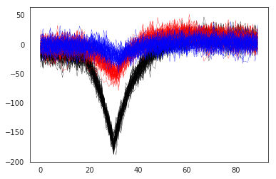
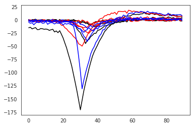
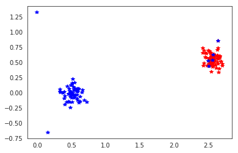
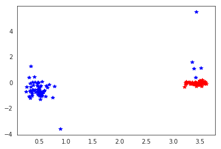

Postprocessing Tutorial
=======================

This notebook shows how to use the spiketoolkit.postprocessing module
to:

1. compute spike waveforms
2. compute unit templates
3. compute unit maximum channel
4. compute pca scores
5. automatically curate spike sorting output
6. export sorted data to phy to curate the results
7. save curated sorting output

.. code:: python

    import spikeextractors as se
    import spiketoolkit as st
    import spikewidgets as sw
    import time
    import numpy as np
    import matplotlib.pylab as plt
    import scipy.signal as ss
    %matplotlib notebook

First, let's create a toy example:

.. code:: python

    recording, sorting = se.example_datasets.toy_example(num_channels=4, duration=30, seed=0)

Assuming the ``sorting`` is the output of a spike sorter, the
``postprocessing`` module allows to extract all relevant information
from the paired recording-sorting.

1) Compute spike waveforms
--------------------------

Waveforms are extracted with the ``get_unit_waveforms`` function by
extracting snippets of the recordings when spikes are detected. When
waveforms are extracted, the can be loaded in the ``SortingExtractor``
object as features. The ms before and after the spike event can be
chosen. Waveforms are returned as a list of np.arrays (n\_spikes,
n\_channels, n\_points)

.. code:: python

    wf = st.postprocessing.get_unit_waveforms(recording, sorting, ms_before=1, ms_after=2, 
                                            save_as_features=True, verbose=True)

.. parsed-literal::

    Waveform 1/10
    Waveform 2/10
    Waveform 3/10
    Waveform 4/10
    Waveform 5/10
    Waveform 6/10
    Waveform 7/10
    Waveform 8/10
    Waveform 9/10
    Waveform 10/10

Now ``waveforms`` is a unit spike feature!

.. code:: python

    sorting.get_unit_spike_feature_names()
    wf[0].shape

.. parsed-literal::

    (76, 4, 90)

.. code:: python

    # plotting waveforms of units 0,1,2 on channel 0
    plt.figure()
    plt.plot(wf[0][:, 0, :].T, color='k', lw=0.3)
    plt.plot(wf[1][:, 0, :].T, color='r', lw=0.3)
    plt.plot(wf[2][:, 0, :].T, color='b', lw=0.3);

If the a certain property (e.g. ``group``) is present in the
RecordingExtractor, the waveforms can be extracted only on the channels
with that property using the ``grouping_property`` and
``compute_property_from_recording`` arguments. For example, if channel
[0,1] are in group 0 and channel [2,3] are in group 2, then if the peak
of the waveforms is in channel [0,1] it will be assigned to group 0 and
will have 2 channels and the same for group 1.

.. code:: python

    channel_groups = [[0, 1], [2, 3]]
    for ch in recording.get_channel_ids():
        for gr, channel_group in enumerate(channel_groups):
            if ch in channel_group:
                recording.set_channel_property(ch, 'group', gr)
    print(recording.get_channel_property(0, 'group'), recording.get_channel_property(2, 'group'))

.. parsed-literal::

    0 1

.. code:: python

    wf_by_group = st.postprocessing.get_unit_waveforms(recording, sorting, ms_before=1, ms_after=2, 
                                                       save_as_features=False, verbose=True,
                                                       grouping_property='group', 
                                                       compute_property_from_recording=True)
    
    # now waveforms will only have 2 channels
    print(wf_by_group[0].shape)

.. parsed-literal::

    Waveforms by property:  group
    Waveform 1/10
    Waveform 2/10
    Waveform 3/10
    Waveform 4/10
    Waveform 5/10
    Waveform 6/10
    Waveform 7/10
    Waveform 8/10
    Waveform 9/10
    Waveform 10/10
    (76, 2, 90)

2) Compute unit templates (EAP)
-------------------------------

Similarly to waveforms, templates - average waveforms - can be easily
extracted using the ``get_unit_templates``. When spike trains have
numerous spikes, you can set the ``max_num_waveforms`` to be extracted.
If waveforms have already been computd and stored as ``features``, those
will be used. Templates can be saved as unit properties.

.. code:: python

    templates = st.postprocessing.get_unit_templates(recording, sorting, max_num_waveforms=200,
                                                  save_as_property=True, verbose=True)

.. parsed-literal::

    Using 'waveforms' features

.. code:: python

    sorting.get_unit_property_names()

.. parsed-literal::

    ['template']

.. code:: python

    # plotting templates of units 0,1,2 on all four channels
    plt.figure()
    _ = plt.plot(templates[0].T, color='k')
    _ = plt.plot(templates[1].T, color='r')
    _ = plt.plot(templates[2].T, color='b')

3) Compute unit maximum channel
-------------------------------

In the same way, one can get the ecording channel with the maximum
amplitude and save it as a property.

.. code:: python

    max_chan = st.postprocessing.get_unit_max_channels(recording, sorting, save_as_property=True, verbose=True)
    print(max_chan)

.. parsed-literal::

    Using 'template' property
    [0, 0, 1, 1, 1, 2, 2, 2, 2, 3]

.. code:: python

    sorting.get_unit_property_names()

.. parsed-literal::

    ['max_channel', 'template']

4) Compute pca scores
---------------------

For some applications, for example validating the spike sorting output,
PCA scores can be computed.

.. code:: python

    pca_scores = st.postprocessing.compute_unit_pca_scores(recording, sorting, n_comp=3, verbose=True)
    
    for pc in pca_scores:
        print(pc.shape)

.. parsed-literal::

    Using 'waveforms' features
    Fitting PCA of 3 dimensions on 713 waveforms
    (76, 3)
    (71, 3)
    (64, 3)
    (72, 3)
    (71, 3)
    (74, 3)
    (74, 3)
    (67, 3)
    (70, 3)
    (74, 3)

.. code:: python

    fig = plt.figure()
    ax = fig.add_subplot(111)
    ax.plot(pca_scores[0][:,0], pca_scores[0][:,1], 'r*')
    ax.plot(pca_scores[2][:,0], pca_scores[2][:,1], 'b*')

.. parsed-literal::

    [<matplotlib.lines.Line2D at 0x7f9e2852c860>]

PCA scores can be also computed electrode-wise. In the previous example,
PCA was applied to the concatenation of the waveforms over channels.

.. code:: python

    pca_scores_by_electrode = st.postprocessing.compute_unit_pca_scores(recording, sorting, n_comp=3, by_electrode=True)
    
    for pc in pca_scores_by_electrode:
        print(pc.shape)

.. parsed-literal::

    (76, 4, 3)
    (71, 4, 3)
    (64, 4, 3)
    (72, 4, 3)
    (71, 4, 3)
    (74, 4, 3)
    (74, 4, 3)
    (67, 4, 3)
    (70, 4, 3)
    (74, 4, 3)

In this case, as expected, 3 principal components are extracted for each
electrode.

.. code:: python

    fig = plt.figure()
    ax = fig.add_subplot(111)
    ax.plot(pca_scores_by_electrode[0][:, 0, 0], pca_scores_by_electrode[0][:, 1, 0], 'r*')
    ax.plot(pca_scores_by_electrode[2][:, 0, 0], pca_scores_by_electrode[2][:, 1, 1], 'b*')

.. parsed-literal::

    [<matplotlib.lines.Line2D at 0x7f9e2848ce10>]

5) Automatically curate the sorted result
-----------------------------------------

Before manually curating your dataset (which can be time intensive on
large-scale recordings) it may be a good idea to perform some automated
curation of the sorted result.

Below is an example of two simple, automatic curation methods you can
run:

.. code:: python

    snr_list = st.validation.qualitymetrics.compute_unit_SNR(recording, sorting)
    print(snr_list)

.. parsed-literal::

    [19.321362668787952, 7.1347723790248265, 14.572200165415367, 10.3590295291215, 9.113611937904054, 9.107864682851742, 15.293601899433895, 7.666255328235154, 5.831489483534372, 18.519676449363974]

.. code:: python

    curated_sorting1 = st.postprocessing.threshold_min_num_spikes(sorting=sorting, min_num_spike_threshold=70)
    print("Unit spike train lengths uncurated: " + str([len(spike_train) for spike_train in [sorting.get_unit_spike_train(unit_id) for unit_id in sorting.get_unit_ids()]]))
    print("Unit spike train lengths curated: " + str([len(spike_train) for spike_train in [curated_sorting1.get_unit_spike_train(unit_id) for unit_id in curated_sorting1.get_unit_ids()]]))

.. parsed-literal::

    Unit spike train lengths uncurated: [76, 71, 64, 72, 71, 74, 74, 67, 70, 74]
    Unit spike train lengths curated: [76, 71, 72, 71, 74, 74, 70, 74]

threshold\_min\_num\_spikes automatically rejects any units with number
of spikes lower than the given threshold. It returns a sorting extractor
without those units

.. code:: python

    curated_sorting2 = st.postprocessing.threshold_min_SNR(recording=recording, sorting=curated_sorting1, 
                                                           min_SNR_threshold=6.0)
    print("Unit SNRs uncurated: " + str(st.validation.qualitymetrics.compute_unit_SNR(recording, curated_sorting1)))
    print("Unit SNRs curated: " + str(st.validation.qualitymetrics.compute_unit_SNR(recording, curated_sorting2)))

.. parsed-literal::

    Unit SNRs uncurated: [19.321362668787952, 7.1347723790248265, 10.3590295291215, 9.113611937904054, 9.107864682851742, 15.293601899433895, 5.831489483534372, 18.519676449363974]
    Unit SNRs curated: [19.321362668787952, 7.1347723790248265, 10.3590295291215, 9.113611937904054, 9.107864682851742, 15.293601899433895, 18.519676449363974]

threshold\_min\_SNR automatically rejects any units with SNR lower than
the given threshold. It returns a sorting extractor without those units

6) Export sorted data to phy to manually curate the results
-----------------------------------------------------------

Finally, it is common to visualize and manually curate the data after
spike sorting. In order to do so, we interface wiht the Phy
(https://phy-contrib.readthedocs.io/en/latest/template-gui/).

First, we need to export the data to the phy format:

.. code:: python

    st.postprocessing.export_to_phy(recording, sorting, output_folder='phy', verbose=True)

.. parsed-literal::

    Changed number of PC to number of channels:  4
    Using 'waveforms' features
    Fitting PCA of 4 dimensions on 2852 waveforms
    Saved phy format to:  /home/alessiob/Documents/Codes/spike_sorting/spikeinterface/spiketoolkit/examples/phy
    Run:
    
    phy template-gui  /home/alessiob/Documents/Codes/spike_sorting/spikeinterface/spiketoolkit/examples/phy/params.py

To run phy you can then run (from terminal):

``phy template-gui phy/params.py``

Or from a notebook:

``!phy template-gui phy/params.py``

In this case, in phy, we manually merged to units. We can load back the
curated data using the ``PhySortingExtractor``:

.. code:: python

    curated_sorting = se.PhySortingExtractor('phy/')

.. code:: python

    print('Before manual curation: ', len(sorting.get_unit_ids()))
    print('After manual curation: ', len(curated_sorting.get_unit_ids()))

.. parsed-literal::

    Before manual curation:  10
    After manual curation:  9

7) Save curated sorting output
------------------------------

The curated recordings can be either saved in any other format, or the
PhySortingExtractor can be used reload the data from the phy format.

.. code:: python

    se.MdaSortingExtractor.write_sorting(sorting=curated_sorting, save_path='curated_results.mda')
