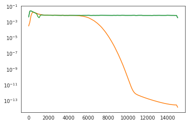
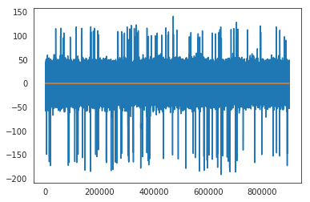
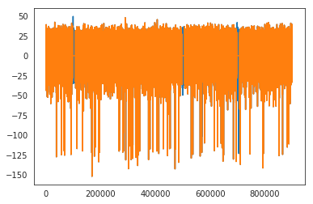

Preprocessing
=============

This notebook shows how to use the spiketoolkit.preprocessing module to:

1. apply filters
2. compute LFP and MUA.
3. change reference
4. remove bad channels
5. remove stimulation artifacts

.. code:: python

    import spikeextractors as se
    import spiketoolkit as st
    import spikewidgets as sw
    import time
    import numpy as np
    import matplotlib.pylab as plt
    import scipy.signal as ss
    %matplotlib notebook

First, let's create a toy example:

.. code:: python

    recording, sorting = se.example_datasets.toy_example(num_channels=4, duration=30)

1) Apply filters
----------------

Now apply a bandpass filter and a notch filter (separately) to the
recording extractor. Filters are also RecordingExtractor objects.

.. code:: python

    recording_bp = st.preprocessing.bandpass_filter(recording, freq_min=300, freq_max=6000)
    recording_notch = st.preprocessing.notch_filter(recording, freq=1000, q=10)

.. parsed-literal::

    Notch filter at:  1000

Now let's plot the power spectrum of non-filtered, bandpass filtered,
and notch filtered recordings.

.. code:: python

    f_raw, p_raw = ss.welch(recording.get_traces(), fs=recording.get_sampling_frequency())
    f_bp, p_bp = ss.welch(recording_bp.get_traces(), fs=recording.get_sampling_frequency())
    f_notch, p_notch = ss.welch(recording_notch.get_traces(), fs=recording.get_sampling_frequency())

.. code:: python

    plt.figure()
    _ = plt.semilogy(f_raw, p_raw[0], f_bp, p_bp[0], f_notch, p_notch[0])

2) Compute LFP and MUA
----------------------

Local field potentials (LFP) are low frequency components of the
extracellular recordings. Multi-unit activity (MUA) are rectified and
low-pass filtered recordings showing the diffuse spiking activity.

In ``spiketoolkit``, LFP and MUA can be extracted combining the
``bandpass_filter``, ``rectify`` and ``resample`` functions. In this
example LFP and MUA are resampled at 1000 Hz.

.. code:: python

    recording_lfp = st.preprocessing.bandpass_filter(recording, freq_min=1, freq_max=300)
    recording_lfp = st.preprocessing.resample(recording_lfp, 1000)
    recording_mua = st.preprocessing.resample(st.preprocessing.rectify(recording), 1000)

The toy example data are only contain high frequency components, but
these lines of code will work on experimental data

3) Change reference
-------------------

In many cases, before spike sorting, it is wise to re-reference the
signals to reduce the common-mode noise from the recordings.

To re-reference in ``spiketoolkit`` you can use the ``common_reference``
function. Both common average reference (CAR) and common median
reference (CMR) can be applied. Moreover, the average/median can be
computed on different groups. Single channels can also be used as
reference.

.. code:: python

    recording_car = st.preprocessing.common_reference(recording, reference='average')
    recording_cmr = st.preprocessing.common_reference(recording, reference='median')
    recording_single = st.preprocessing.common_reference(recording, reference='single', ref_channel=0)
    recording_single_groups = st.preprocessing.common_reference(recording, reference='single', groups=[[0,1], [2,3]], 
                                                                ref_channel=[0,2])

.. code:: python

    plt.figure()
    _ = plt.plot(recording_car.get_traces()[0])
    _ = plt.plot(recording_cmr.get_traces()[0])
    plt.figure()
    _ = plt.plot(recording_single_groups.get_traces()[1]) # not zero
    _ = plt.plot(recording_single_groups.get_traces()[0])

.. parsed-literal::

    Common average in groups:  [[0, 1], [2, 3]]
    Common average in groups:  [[0, 1], [2, 3]]

.. image:: preprocessing_example_files/preprocessing_example_15_1.png

4) Remove bad channels
----------------------

In to remove noisy channels from the analysis, the
``remove_bad_channels`` function can be used.

.. code:: python

    recording_remove_bad = st.preprocessing.remove_bad_channels(recording, bad_channels=[0])

.. code:: python

    print(recording_remove_bad.get_channel_ids())

.. parsed-literal::

    [1, 2, 3]

As expected, channel 0 is removed. Bad channels removal can also be done
automatically. In this case, the channels with a standard deviation
exceeding ``bad_threshold`` times the median standard deviation are
removed. The standard deviations are computed on the traces with length
``seconds`` from the middle of the recordings.

.. code:: python

    recording_remove_bad_auto = st.preprocessing.remove_bad_channels(recording, bad_channels='auto', bad_threshold=2,
                                                                     seconds=2)

.. code:: python

    print(recording_remove_bad_auto.get_channel_ids())

.. parsed-literal::

    [0, 1, 2, 3]

With these simulated recordings, there are no noisy channe

5) Remove stimulation artifacts
-------------------------------

In some applications, electrodes are used to electrically stimulate the
tissue, generating a large artifact. In ``spiketoolkit``, the artifact
can be zeroed-out using the ``remove_artifact`` function.

.. code:: python

    # create dummy stimulation triggers
    stimulation_trigger_frames = np.array([100000, 500000, 700000])

.. code:: python

    # large ms_before and s_after are used for plotting only
    recording_rmartifact = st.preprocessing.remove_artifacts(recording, 
                                                             triggers=stimulation_trigger_frames, 
                                                             ms_before=100, ms_after=200)

.. code:: python

    plt.figure()
    _ = plt.plot(recording.get_traces()[0])
    _ = plt.plot(recording_rmartifact.get_traces()[0])

After the proper preprocessing step, you are ready to run spike sorting!
